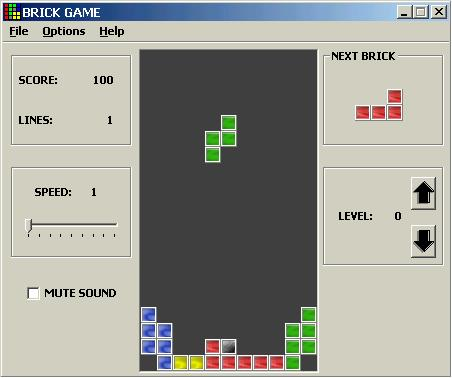



## Brick\_Game

### Description

I have made this program for my 4th Semester project. Its a simple Brick Game with 9 levels and sounds.
 
### More Info
 

             |
---                |---
**Submitted On**   |2003-04-29 21:16:36
**By**             |[Muhammad Asif Hafeez](https://github.com/Planet-Source-Code/PSCIndex/blob/master/ByAuthor/muhammad-asif-hafeez.md)
**Level**          |Intermediate
**User Rating**    |5.0 (40 globes from 8 users)
**Compatibility**  |VB 5\.0, VB 6\.0
**Category**       |[Games](https://github.com/Planet-Source-Code/PSCIndex/blob/master/ByCategory/games__1-38.md)
**World**          |[Visual Basic](https://github.com/Planet-Source-Code/PSCIndex/blob/master/ByWorld/visual-basic.md)
**Archive File**   |[Brick\_Game1587545142003\.zip](https://github.com/Planet-Source-Code/muhammad-asif-hafeez-brick-game__1-45464/archive/master.zip)

